<!-- animated contribution graph (regenerated daily by .github/workflows/update-profile-art.yml) -->

 
 

<table>
     <tr>
          <!-- portrait (python scripts/prep_photo.py <photo> & python scripts/make_ascii_svg.py) ; info panel: python scripts/make_info_card.py -->
          <td valign="top"></td>
          <!-- portrait (python scripts/prep_photo.py <photo> & python scripts/make_ascii_svg.py) ; info panel: python scripts/make_info_card.py -->
          <td valign="top"></td>
     </tr>
</table>

 

<b>professional debugger and clinical informatics analyst</b>

 

